# Full Stack Implementation Exercise

## 1. Technologies

Developed and tested on **Linux-x64**.

Name|Version|Description
----|-------|-----------
node|20.10.0|JavaScript runtime
npm|10.2.3|Package manager for NodeJS
standard|17.1.0|Code linter
express|4.19.2| Web Framework
sequelize|6.37.1|ORM
sqlite3|5.1.7|SQL database engine
vite|5.2.7|Frontend build tool
react|18.2.0|UI library

## 2. Directories

- `/` contains README and the rest of the directories.
- `backend/` has the script to start the server and database. MVC subdirectories.
    - `constants/` has the entities (DTOs) and constraints for `sequelize`.
    - `utils/` has the script for initialize and setup the database.
- `diagrams/` has the ER and sequence diagrams, made with PlantUML.
- `frontend/` has the UI made with Vite + React.

## 3. Database setup

Database ERD

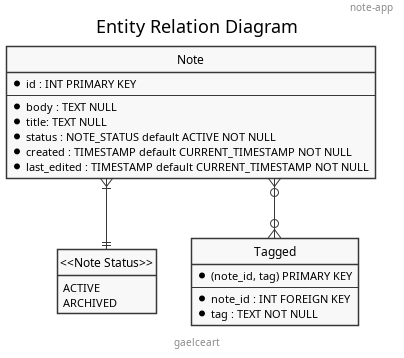

The creation of database, tables, contraints and relations is managed by `sequelize` ORM.

This ORM communicates with the relational database engine `sqlite3`.

## 4. Development

### 4.1 Backend

Backend was developed following the Model-View-Controller design pattern. Therefore, it divides in these three main layers.

In the following diagrams, you can see the operation of the backend in its different layers.

Heres an example:

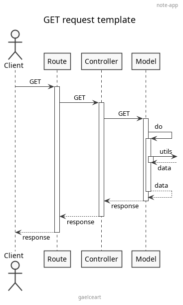

> [!IMPORTANT]
>
> `sequelize` **models** represent their table in the database, that is, they are *DTOs* and also have built-in methods for communicating with the database, in other words, they are also *DAOs*.

---

#### 4.1.1 Notes

> USER STORY
>
> As a user, I want to be able to create, edit, and delete notes.

Create note

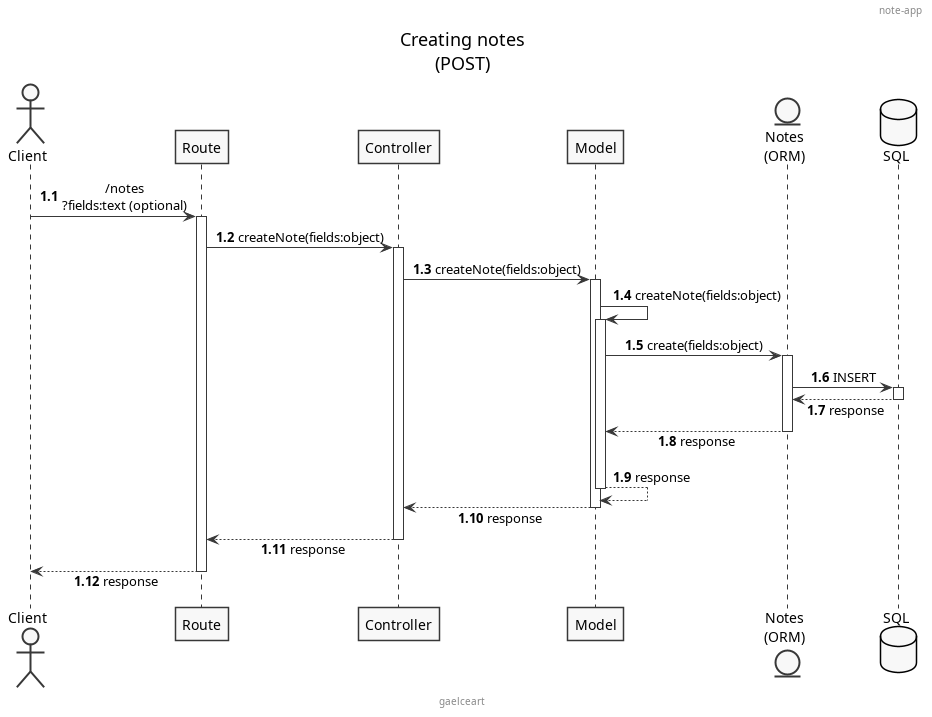

---

Fetch notes

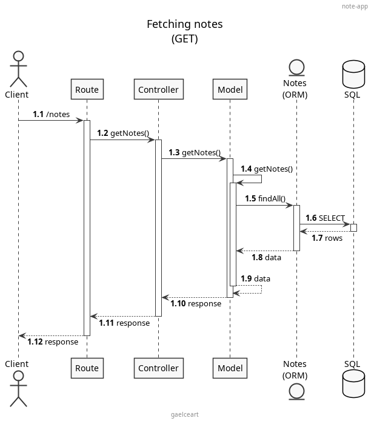

---

Edit note

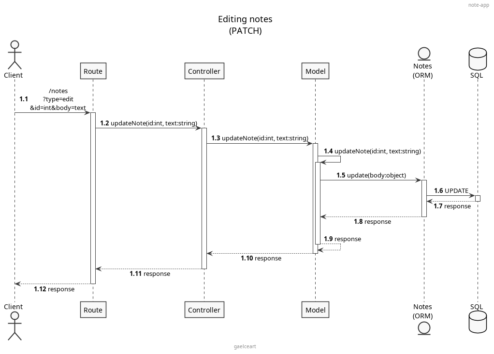

---

Delete note

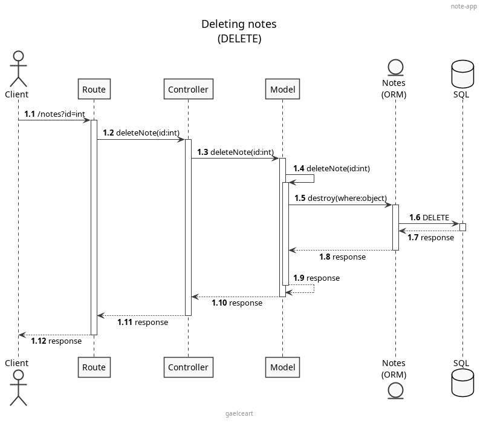

---

> USER STORY
>
> As a user, I want to archive/unarchive notes.

Archive/Unarchive note (same as edit, different query parameters)

---

> USER STORIES
>
> As a user, I want to list my active notes.
>
> As a user, I want to list my archived notes.

Filter notes by status

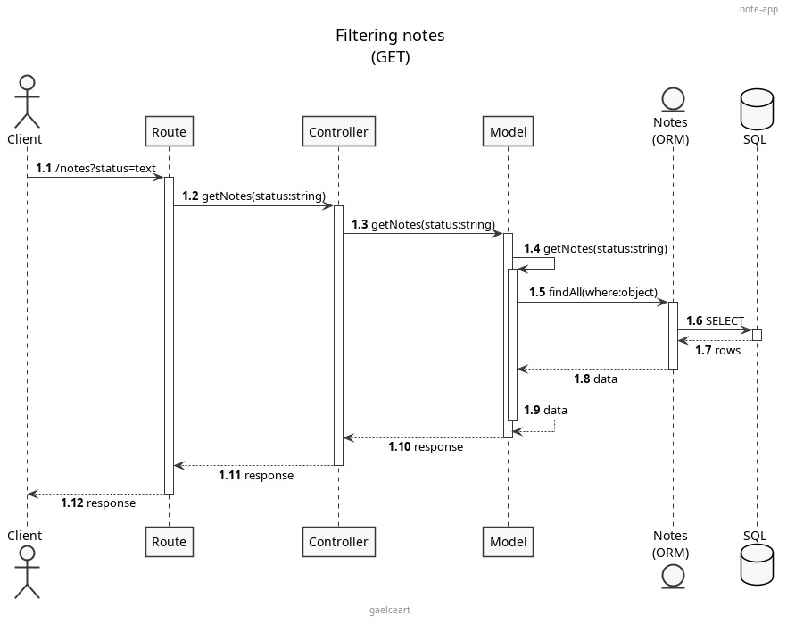

---

#### 4.1.2 Tags

> USER STORY
>
> As a user, I want to be able to add/remove categories to notes.

Add tag to note

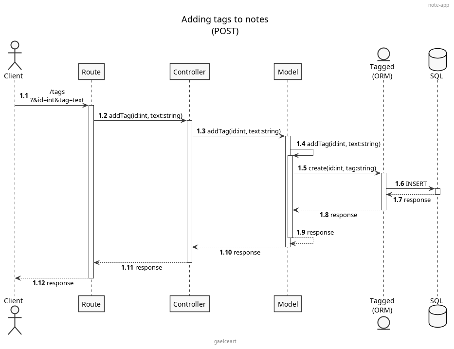

---

Remove tag from note

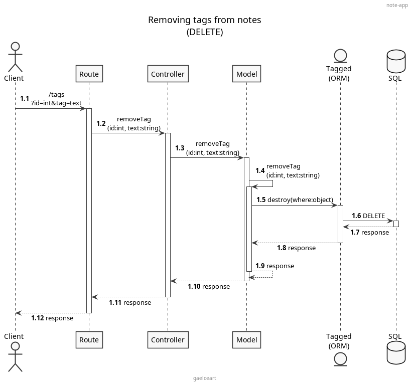

---

Fetch tags

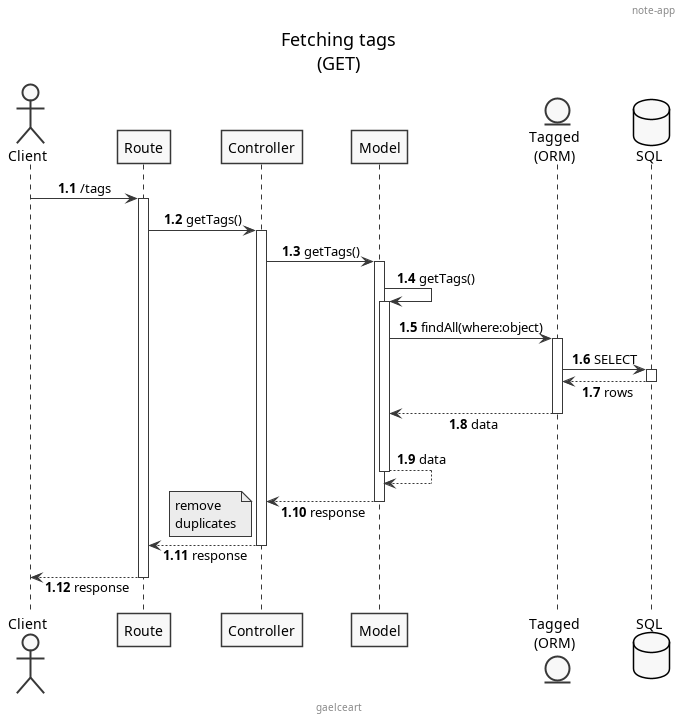

---

> USER STORY
>
> As a user, I want to be able to filter notes by category.

Filter notes by tag

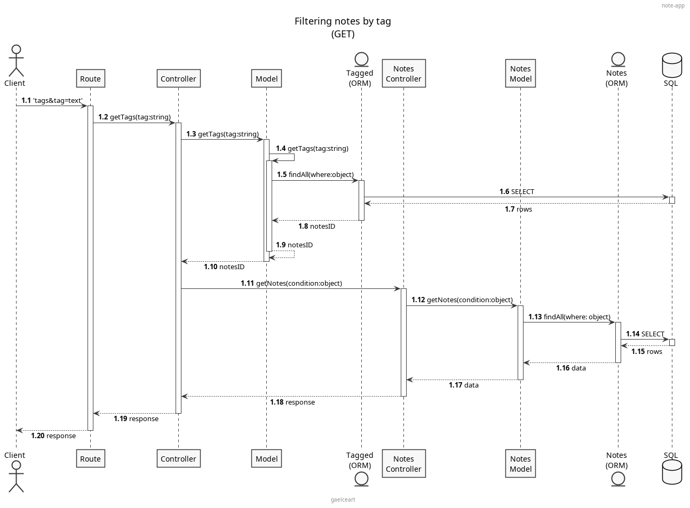

---

### 4.2 Frontend

Notes:

- ✅ CRUD operations
- ✅ Archive/unarchive
- ✅ Filter by status

Tags:

- ✅ Add tag
- ✅ Remove tag
- ✅ Show tags on notes
- ✅ Show all tags
- ❌ Filter by tag

## 5. Shell Script

Shell script for **zsh**.

Install npm dependencies, initialize database, server, frontend and opens `http://localhost:5173`.

When script is interrupted (CTRL + C) also the app stop executing.
